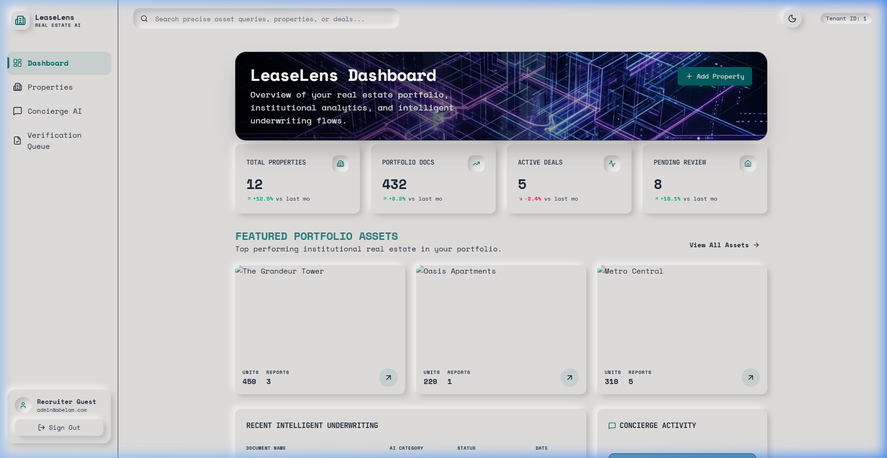
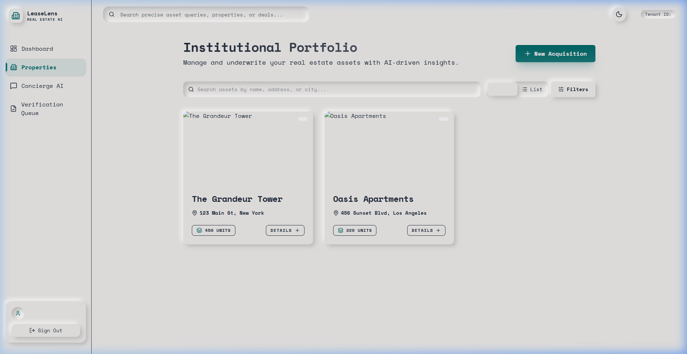
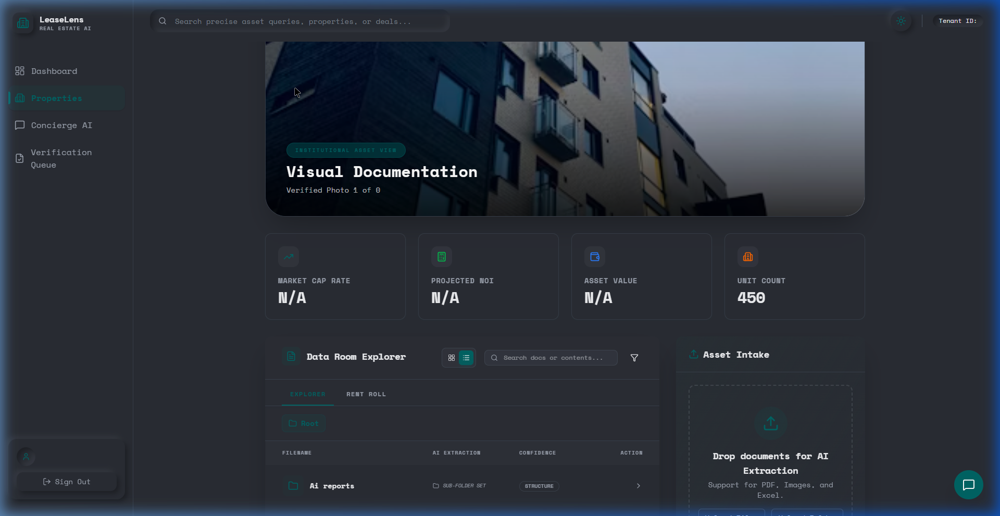

# 🏢 LeaseLens — Intelligent Real Estate Acquisition & Due Diligence

**LeaseLens** is a next-generation real estate acquisition platform designed for institutional investors and asset managers. It automates the document-heavy due diligence process by leveraging a sophisticated **Multi-Agent AI Pipeline** to extract, validate, and underwrite commercial real estate deals in seconds.

---

## ✨ Key Features

### 🎨 Premium Neumorphic UI
A cutting-edge design system built with **Tailwind CSS 4.0**. The interface uses tactile, soft-shadow aesthetics (Neumorphism) to provide a professional yet modern experience for high-density financial data navigation.

### 🤖 Multi-Agent AI Pipeline
The core of LeaseLens is a collaborative system of **5 specialized AI agents** that process documents (Rent Rolls, T12s, OMs, Leases) in parallel:
*   **Intake Agent:** Categorizes and cleans incoming document data.
*   **Extraction Agent:** Uses OCR and LLMs to pull structured financial metrics.
*   **Validation Agent:** Cross-references data points across documents to ensure 100% accuracy.
*   **Underwriting Agent:** Calculates Cap Rates, NOI, and Asset Values based on extracted metrics.
*   **Reporting Agent:** Synthesizes insights into human-readable deal summaries.

### 💬 AI Concierge
An integrated natural language interface allows users to "talk to their portfolio." Ask questions like *"What is the average occupancy across the New York assets?"* or *"Summarize the lease risks for The Grandeur Tower."*

### 📂 Data Room Explorer
A professional-grade file management system that automatically organizes uploaded documents into logical categories (Leases, Financials, Photos, etc.) with real-time status tracking via WebSockets.

---

## 🛠️ Technical Architecture

LeaseLens is built with a scalable, modern full-stack architecture:

### Frontend
*   **React 19 & TypeScript:** For a type-safe, performant component architecture.
*   **Vite:** Ultra-fast build tool and development server.
*   **Tailwind CSS 4.0:** Utilizing CSS-first configuration and custom Neumorphic utilities.
*   **Framer Motion:** Powering smooth layout transitions and micro-animations.
*   **Recharts:** For high-fidelity data visualization and financial charting.

### Backend
*   **FastAPI:** High-performance Python web framework for the core API layer.
*   **PostgreSQL:** Relational database for persistent asset and document metadata.
*   **Redis & Celery:** Powering the asynchronous multi-agent processing task queue.
*   **LangGraph:** Orchestrating the complex state-management of the AI agent collaboration.

---

## 📸 Screenshots

### Portfolio Overview
Manage multiple institutional assets from a single, unified view with real-time performance tracking.

### Asset Deep-Dive
Deep-dive into specific properties with automated document extraction and unit-level granularity.

---

## 🚀 Showcase Mode
This repository is currently configured for a **Frontend-only Showcase Mode**. 
*   All API calls are intercepted and served via a **Mock Data Layer** (`src/api/mockData.ts`).
*   This allows recruiters and collaborators to experience the full UI/UX and logic of the application without needing a live backend or database.
*   **Login Credentials:** `recruiter@leaselens.com` / `showcase_mode` (Pre-filled on the login page).

---

## 📄 License
This project is for demonstration purposes. All rights reserved.
